# Morphometric Parameter Reference Table

A companion to [`reader_measurement_guide.md`](reader_measurement_guide.md). For each
parameter measured by the pipeline this table gives the textbook definition, the
clinical rationale, a step-by-step summary of how the algorithm implements it
(condensed from the guide), and a normal-adult reference range with a literature
citation.

**Important caveats**

- Reference ranges are **method- and modality-dependent**. Where the algorithm's
  landmark choice materially shifts the expected value (most strongly for femoral
  and tibial torsion), this is flagged in the range column. Always interpret the
  algorithm's output against a range obtained with a comparable technique.
- Distances are in millimetres in patient (world) coordinates; angles are unsigned
  degrees unless a sign convention is stated.
- "Side" is the *image* side, not the patient side (see guide §0.2).

Citations are keyed `[n]` to the [References](#references) section.

| Parameter | Textbook definition | Clinical rationale | Implementation | Reference range |
|-----------|---------------------|--------------------|----------------|-----------------|
| **Femoral torsion (anteversion)** | Transverse-plane angle between the femoral neck axis (proximal reference) and the posterior condylar line of the distal femur (distal reference). | Quantifies rotational deformity of the femur; excessive anteversion or retroversion contributes to patellofemoral instability, gait abnormality, in-/out-toeing, and femoroacetabular impingement, and guides derotation osteotomy planning. | (1) Fit a sphere to the femoral head → centre and radius *r*. (2) **Proximal line, two methods.** *Lee:* on the first inferior slice where the femur is a single outline and a circle of radius 2·*r* still hits bone, keep outline points in a ring ≈0.9–1.1·*r* near the neck centre of mass and fit a line through them and the head centre. *Murphy:* find the slice where the lesser trochanter is most prominent; the neck base is the shaft cross-section centroid there; the line runs head centre → neck base. (3) **Distal line:** on the slice with the largest convex condylar bone area, the tangent to the two posterior condyles. (4) Measure each line's angle to the medial–lateral axis in the transverse plane, fold to 0–90°, and add (opposite AP tilt) or subtract (same tilt). Both Lee and Murphy values are reported. | Strongly method-dependent. *Lee* (proximal neck landmark) ≈ **8–15°** (CT 11°±11°); *Murphy* (distal neck landmark) ≈ **18–28°** (CT 28°±13°) — the two differ by ~17° on the same hip. Classic mixed-method normal ≈ 10–15° (broad 8–20°); retroversion <5°, excessive >20°. CT and MRI agree closely. [1][2] |
| **Tibial torsion** | Transverse-plane angle between the posterior condylar line of the proximal tibia and the distal trans-malleolar / tibia–fibula line. | Quantifies rotational deformity of the tibia; excessive external torsion causes out-toeing and patellofemoral malalignment; relevant to derotation osteotomy and to interpreting overall lower-limb torsional profile. | (1) **Proximal line:** as for the femoral condylar line (§1.2) but on the tibia — on the proximal tibial slice with the largest convex bone area, the tangent to the two posterior plateau aspects. (2) **Distal line:** on the slice with the largest tibial (equivalent-ellipse) diameter at the ankle, connect the tibia centroid to the fibula centroid. (3) Measure each line's angle to the medial–lateral axis, fold to 0–90°, add/subtract by AP tilt direction. | External (positive) and governed by the *distal* landmark: trans-malleolar axis ≈ **40°±9°**; bimalleolar axis ≈ **20–30°**. Whole-limb CT cohorts ≈ 33–35°. This pipeline uses tibia–fibula centroids (closer to the trans-malleolar family). MRI is a valid CT substitute. [3][4] |
| **Knee rotation angle** | Transverse-plane angle between the posterior condylar line of the distal femur and the posterior condylar line of the proximal tibia (rotational femoro-tibial mismatch). | Captures rotational alignment of the knee joint itself; relevant to patellofemoral tracking and to component rotation in arthroplasty planning. | (1) **Femoral line** as in femoral torsion §1.2. (2) **Tibial line** as in tibial torsion §2.1, both taken at the knee. (3) Transverse-plane angle between them, folded to 0–90° and combined by AP tilt direction; an exact 180° result is reset to 0°. | No standardized normative range for this exact bony pairing exists in the literature; the posterior condylar lines are near-parallel in extension, so the isolated angle is small (single-digit degrees). Nearest published surrogates (different reference lines): EOS femoro-tibial rotation 2.3°±7.2°; CT tibiofemoral rotation ~4.1°±5.3°. State your reference lines explicitly. [5][6] |
| **CCD angle (caput–collum–diaphyseal / neck–shaft)** | Angle between the femoral shaft axis and the femoral neck axis. | Used to detect deformities such as coxa valga and coxa vara, and to plan hip replacement or osteosynthesis after proximal femur fractures. | (1) Fit sphere to femoral head to determine its centre. (2) Define femoral neck centre as the centroid of the femoral voxels in a hollow shell (between *r* and 1.2·*r*) that lie both distal and lateral to the head centre; neck axis = head centre → neck centre. (3) Determine the shaft axis from the distal-slice centroid of the proximal femur to the proximal-slice centroid of the knee femur (or, without a knee image, up to the greater-trochanter region). (4) Compute the angle between shaft and neck axes, reported as the obtuse value; also a coronal-plane projection (AP component zeroed). | Adult normal ≈ **126–132°** (rotation-corrected CT: M 129.6°±5.9°, F 131.9°±6.8°); teaching range 120–135°. Coxa vara <120°, coxa valga >135°. Reference plane and rotation correction shift the value by a few degrees. [7] |
| **Bone length (femur / tibia / whole leg)** | Straight-line (Euclidean) distance in mm between the proximal-most and distal-most bone centroids. | Quantifies limb and segment length for leg-length-discrepancy assessment and surgical/orthotic planning. | (1) **Proximal point:** centre of mass on the most proximal (superior) bone slice. (2) **Distal point:** centroid of the most distal slice (femur / whole leg), or — for the tibia — the centroid of the distal articulating surface (plafond slice, the most distal slice before the cross-sectional area changes abruptly), not the malleolus tip. (3) 3D distance between the two centroids in patient coordinates (mm), accounting for slice spacing. | Highly sex- and population-dependent. Radiographic (standing, full-length): femur ≈ **500 mm** (range ~393–584), tibia ≈ **390 mm** (range ~308–465), femorotibial ratio ~1.28:1. Cadaveric "maximum length" runs ~5–6 cm shorter than radiographic length — definitions are not interchangeable. [8] |
| **Acetabular version (anteversion)** | Transverse-plane angle describing how anteverted the acetabular opening is, on a single transverse slice. | Abnormal acetabular version (retroversion or excessive anteversion) is associated with femoroacetabular impingement, instability, and hip osteoarthritis. | (1) Locate both femoral head centres (sphere fit); the measurement slice is midway between them. (2) On that slice, per acetabulum, find the posterior rim point p1 (most lateral bone in the posterior portion) and anterior rim point p2 (most lateral bone in the anterior portion). (3) Build reference line G joining the two head centres. (4) Construct the perpendicular to G through p1; the version is the angle between the rim line (p1 → p2) and that perpendicular. | ≈ **15°±6°**; normal band roughly **10–25°** (<10° too little, >25° too much, both linked to OA). CT cohort means cluster 16–21°, a few degrees higher in women. Strongly plane-/modality-dependent. [9] |
| **Center-edge (CE) angle of Wiberg (LCEA)** | Coronal-plane angle between a vertical reference through the femoral head centre and the line from the head centre to the lateral edge of the acetabular roof. | Primary measure of lateral acetabular coverage of the femoral head; low values indicate hip dysplasia (undercoverage), high values pincer-type overcoverage. | (1) Locate both femoral head centres (sphere fit) and reference line G joining them; the vertical reference is the line through the head centre perpendicular to G, directed superiorly. (2) Lateral acetabular edge = the most lateral (then most superior) bony point of the acetabular roof above the head (search starts ~1.1–1.5·*r* above the head centre). (3) CE angle = angle between the vertical reference and the head-centre → lateral-edge line, in the coronal plane. | Mean **33.6°** (2.5th–97.5th pct 18.1–48.0°). Thresholds: <20° dysplasia, 20–25° borderline, **25–40° normal**, >40° overcoverage (pincer FAI). Underestimated on plain films vs 3D CT. [10] |
| **Femoral offset** | Perpendicular distance (mm) from the femoral head centre to the femoral shaft axis. | Determines the hip abductor moment arm; restoring native offset in total hip arthroplasty is important for abductor strength, stability, and wear. | (1) Femoral head centre (sphere fit). (2) Femoral shaft axis (same construction as CCD §4.1 step 3). (3) Drop a perpendicular from the head centre onto the shaft axis; offset = its length in mm in patient coordinates. (A projected variant zeroes the AP component for a pure coronal measurement; default is full 3D.) | Mean ≈ **43 mm** (43.0±6.8 mm; range ~24–61 mm). Larger in men, scales with femur size; plain radiographs underestimate vs CT. [11] |
| **Hip–knee–ankle (HKA) angle** | Coronal-plane mechanical-axis angle at the knee between the femoral-head→knee segment and the knee→ankle segment. **This pipeline reports deviation from straight (0° = perfectly straight), not the 180°-based convention.** | The principal measure of coronal limb alignment (varus/valgus); central to osteotomy and arthroplasty planning and to osteoarthritis risk assessment. | (1) **Hip point:** femoral head centre (sphere fit). (2) **Knee point:** tibia centre of mass in the knee region. (3) **Ankle point:** centroid of the distal tibial articulating surface (plafond slice). (4) Project hip→knee and knee→ankle vectors to the coronal plane (AP component zeroed) and report the angle between them; a straight axis ≈ 0°, varus/valgus increases it. | Neutral ≈ **0°** deviation; mechanically-normal limbs run to ~**1.5° varus** (constitutional aHKA 1.14°±1.85° varus; normal band ~1° valgus–3.2° varus). Equivalent to conventional HKA ≈ 178.5°±2° (180° = straight; <180° varus, >180° valgus). General-population SD is wider (~±5°). [12][13] |
| **Joint-line convergence angle (JLCA)** | Coronal-plane angle between the distal femoral joint line and the proximal tibial joint line. | Reflects intra-articular (cartilage/soft-tissue) contribution to coronal deformity; distinguishes bony from intra-articular malalignment in osteotomy planning. | (1) **Femoral joint line:** from transverse scanning, the two distal-most condylar centres (smaller-condyle centroid on the most distal two-component slice; the other from the most distal single-component slice), projected to the coronal plane. (2) **Tibial joint line:** intercondylar eminence = centroid of the most proximal tibial slice; restrict to the outer thirds of each plateau (lateral/medial of the eminence by >⅔ of the eminence-to-edge distance), take the most proximal point in each region (the plateau apices), projected to the coronal plane. (3) JLCA = angle between the two lines, folded to ≤90°. | ≈ **0–2°** (joint lines near-parallel); healthy cohort 1.2°±2.7°. Lateral opening conventionally positive; magnitude rises with OA severity and laxity. [13][14] |
| **Mechanical-axis deviation (MAD)** | Perpendicular distance (mm) from the knee centre to the mechanical (Mikulicz) axis, in the coronal plane. | Quantifies the magnitude of coronal malalignment in millimetres; used alongside HKA to plan and verify deformity correction. | (1) Femoral head centre (sphere fit). (2) Ankle centre = centroid of the distal tibial articulating surface (plafond slice). (3) Mikulicz line = head centre → ankle centre. (4) Knee centre = tibia centre of mass in the knee region. (5) Project all three to the coronal plane; MAD = perpendicular distance from the knee centre to the Mikulicz line. **Sign:** negative for medial deviation, positive for lateral. | Mikulicz line normally passes ~**8 mm±7 mm medial** to the knee centre; normal commonly stated as **1–15 mm medial** (>15 mm medial = varus/abnormal). Alternative refs cite 4±2 mm medial. Physiological normal is a small medial offset, not zero. [15] |

## Illustrations

Schematic diagrams of each parameter (reference lines, landmarks, and the measured
angle / distance) live in [`illustrations/`](illustrations/) — see its
[`README`](illustrations/README.md) for the visual key. They are didactic, not
anatomically exact, and not for clinical use.

| | | |
|:---:|:---:|:---:|
| 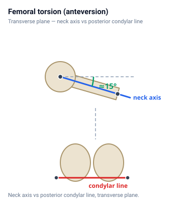 | 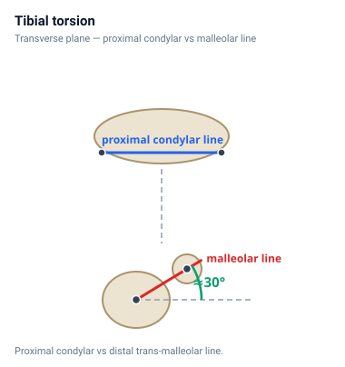 | 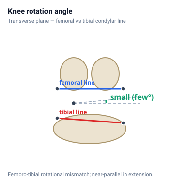 |
| **Femoral torsion** | **Tibial torsion** | **Knee rotation angle** |
| 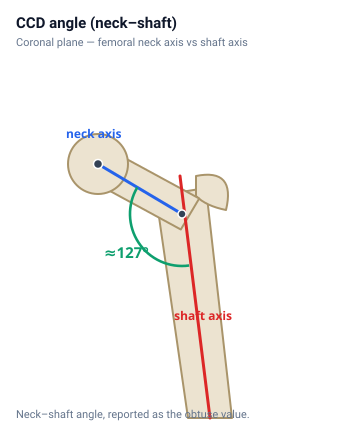 | 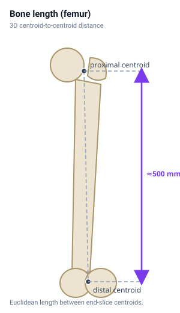 | 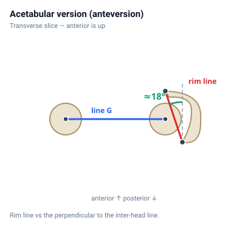 |
| **CCD (neck–shaft) angle** | **Bone length** | **Acetabular version** |
| 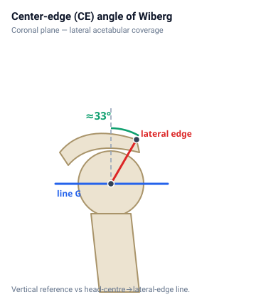 | 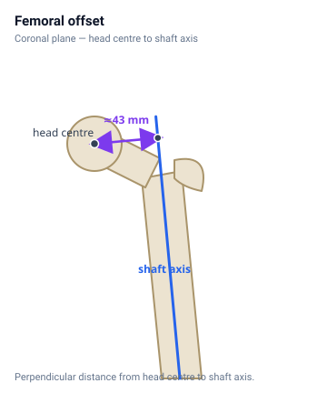 | 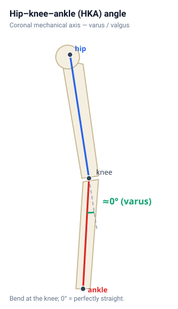 |
| **Center-edge (CE) angle** | **Femoral offset** | **Hip–knee–ankle (HKA) angle** |
| 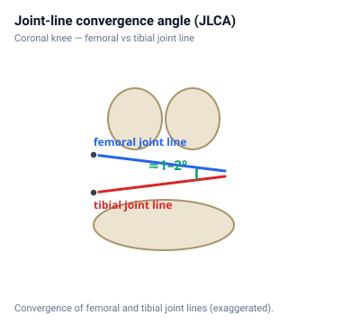 | 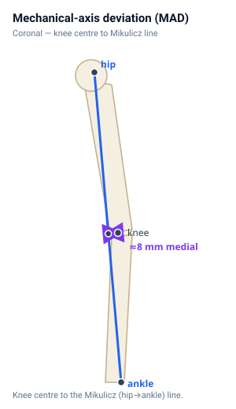 | |
| **Joint-line convergence angle** | **Mechanical-axis deviation** | |

## References

1. Schmaranzer F, Lerch TD, Siebenrock KA, et al. Differences in Femoral Torsion Among Various Measurement Methods Increase in Hips With Excessive Femoral Torsion. *Clin Orthop Relat Res.* 2019;477(5):1073–1083.
2. Murphy SB, Simon SR, Kijewski PK, et al. Femoral anteversion. *J Bone Joint Surg Am.* 1987;69(8):1169–1176.
3. Jend HH, et al. CT determination of tibial torsion (trans-malleolar axis method). 1981. (See also Strecker W, Keppler P, Gebhard F, Kinzl L. Length and torsion of the lower limb. *J Bone Joint Surg Br.* 1997;79-B(6):1019–1023.)
4. Schneider B, Laubenberger J, et al. Measurement of femoral antetorsion and tibial torsion by MR imaging. *Br J Radiol.* 1997;70:575–579.
5. Than P, Szuper K, Somoskeöy S, et al. Geometrical values of the normal and arthritic hip and knee detected with the EOS imaging system. *Int Orthop.* 2012;36(6):1291–1297.
6. Lu Y, Ren X, Liu B, et al. Tibiofemoral rotation alignment in normal knee joints among Chinese adults: a CT analysis. *BMC Musculoskelet Disord.* 2020;21:323.
7. Boese CK, Jostmeier J, Oppermann J, et al. The neck-shaft angle: CT reference values of 800 adult hips. *Skeletal Radiol.* 2016;45(4):455–463. (See also the radiographic systematic review, *Skeletal Radiol.* 2016;45(1):19–28, pooled 128.8°.)
8. Aitken SA. Normative Values for Femoral Length, Tibial Length, and the Femorotibial Ratio in Adults Using Standing Full-Length Radiography. *Osteology.* 2021;1(2):86–95.
9. Tönnis D, Heinecke A. Acetabular and femoral anteversion: relationship with osteoarthritis of the hip. *J Bone Joint Surg Am.* 1999;81(12):1747–1770. (Foundational CT method: Reikerås O, Bjerkreim I, Kolbenstvedt A. *Acta Orthop Scand.* 1983;54(1):18–23.)
10. Werner CMC, Ramseier LE, Ruckstuhl T, et al. Normal values of Wiberg's lateral center-edge angle and Lequesne's acetabular index — a coxometric update. *Skeletal Radiol.* 2012;41(11):1273–1282. (Original: Wiberg G. *Acta Chir Scand.* 1939.)
11. Noble PC, Alexander JW, Lindahl LJ, et al. The anatomic basis of femoral component design. *Clin Orthop Relat Res.* 1988;(235):148–165.
12. Lan et al. Normative distribution of the arithmetic hip–knee–ankle angle in individuals with normal mechanical alignment. *The Knee*, 2024 (aHKA 1.14°±1.85° varus; normal band 1° valgus–3.2° varus).
13. Kura R, et al. Normative values of radiographic parameters in coronal-plane lower-limb alignment in a general Japanese population (Iwaki cohort). 2025 (HKA 1.8°±5.1° varus; JLCA 1.2°±2.7°).
14. Managing intra-articular deformity in high tibial osteotomy: a narrative review. *J Exp Orthop.* 2020;7:64 (defines JLCA, normal ~0–2°, lateral-opening-positive).
15. Paley D. *Principles of Deformity Correction.* Springer, 2002 (MAD ~8 mm±7 mm medial; normal 1–15 mm medial; medial = varus, lateral = valgus). See also Sabharwal S, et al. Radiological assessment of lower-limb alignment. *EFORT Open Rev.* 2021;6(6):487–494.
